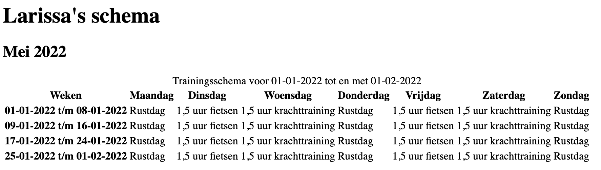

# Human Centered Design

## Table of contents
- [Human Centered Design](#human-centered-design)
  - [Table of contents](#table-of-contents)
  - [Concept](#concept)
  - [Live demo](#live-demo)
  - [Test 1](#test-1)
  - [Test 2](#test-2)
    - [Aanpak na test 2](#aanpak-na-test-2)
  - [Test 3](#test-3)
  - [Design Principles](#design-principles)
    - [Study situation](#study-situation)
    - [Ignore conventions](#ignore-conventions)
    - [Prioritise identity](#prioritise-identity)
    - [Add nonsense](#add-nonsense)
  - [User scenario](#user-scenario)
  - [Reflectie](#reflectie)
  - [Assignment](#assignment)
    - [Ontwerpen met en voor echte mensen](#ontwerpen-met-en-voor-echte-mensen)
    - [Leerdoelen](#leerdoelen)
  - [Rubric](#rubric)
  - [Features](#features)
  - [Installation](#installation)
  - [License](#license)

## Concept

Deze applicatie is een trainingsschema die speciaal gemaakt is voor Larissa. Larissa is een topsportster in het baanwielrenner en Larissa ziet nog maar 1%. In haar huidige trainingsschema kan Larissa de informatie die ze nodig heeft niet vinden, omdat het heel ingewikkeld in elkaar zit en omdat er kleuren worden gebruikt voor bepaalde dingen die Larissa natuurlijk niet kan zien. Dit ben ik gaan verbeteren. Ik ben het trainingsschema goed bruikbaar gaan maken voor Larissa, door ervoor te zorgen dat zij met de screen reader en gemakkelijk doorheen kan navigeren. Hiervoor maak ik bijvoorbeeld gebruik van tabindex en zorg ik ervoor dat Larissa als eerst de planning van vandaag zien aangezien dat hetgeen is waar ze het trainingsschema het meest voor gebruikt.

## Live demo

[Live demo](https://human-centered-design-training.herokuapp.com/)

## Test 1

De eerste test was eigenlijk grotendeels een kennismaking met Larissa. Ik ben veel over haar te weten gekomen en bepaalde voorkeuren van haar wat ze fijn zou vinden voor het trainingsschema zijn goed aan het licht gekomen.

- Braille bord (leesregel) gebruikt ze bijna nooit.
- Ze wil niet al 3 maanden verder hebben dat gepland staat wanneer ze krachttraining heeft e.d. Ze voelt zelf aan wat haar lichaam nodig heeft en daar gaat ze dan ook op trainen.
- Ze wil snel de info die ze nodig heeft kunnen vinden (ook tijdens een training wat er in die training gedaan moet worden).
- Ze gebruikt graag de tab-toets.
- Ze vindt het fijn om te weten wanneer ze vrij is.
- Screen reader in het Nederlands.
- H-toets om te kijken hoeveel en welke headers er zijn, i-toets voor de lijsten.
- Ze wilt makkelijk kunnen navigeren.
- Ze houdt tevens zelf haar voortgang van de trainingen bij in haar notities. Dit is een leuk onderdeel wat ik zou kunnen verwerken in het schema, zodat zij per training overzichtelijk kan bijhouden wat ze heeft gedaan.

**Aanpak na test 1**

Ik ga nu aan de slag met het maken van het trainingsschema. Ik laat Larissa beginnen op de maand dat het is, dus april. Hierbij ga ik haar de keuze geven om naar de vorige of volgende maand te navigeren of om naar een dag te gaan navigeren. Als ze naar een dag gaat, ziet ze daar wat voor training ze heeft en kan ze notities van die training toevoegen zodat deze notities bij die dag opgeslagen blijven.

## Test 2

Test twee is goed gegaan. Ik heb Larissa gewoon door het schema heen laten gaan zonder dat ik er iets bij vertelde. Ik heb haar het schema zelf laten ontdekken, zoals ze dat normaal ook zou doen met een website. Wat heel erg fijn was, is dat Larissa eigenlijk uit zichzelf volledig hardop denkt. Hierdoor krijg je goede feedback terug en weet je wat in haar gedachten om gaat bij het gebruik van het schema. De volgende punten kan ik nog verbeteren:

- Voeg een zoekfunctie toe om naar een specifieke dag te gaan: Een maand invullen en dan een week kiezen.
- Je kan eventueel een optie toevoegen om een maand/jaar te kiezen.
- Als je van een dag terug gaat naar het maandoverzicht dat je focus dan nog op de dag zit waar je net bent geweest.
- Vandaag en morgen zijn eigenlijk het belangrijkst. Wat ze tijdens een training moet doen, bekijkt ze alleen op de dag zelf.
- Voor de volgende dag bekijkt ze waar en hoe laat ze ergens moet zijn. (dus ik kan haar bijvoorbeeld laten beginnen op de dag van vandaag).
- Op de dag pagina kloppen de headings nog niet helemaal.
- Bij textarea nog een label toevoegen.

### Aanpak na test 2

Ik ga Larissa laten beginnen in het schema op vandaag, omdat dat hetgeen is waar ze het schema het meeste voor gebruikt. Vanuit daar laat ik haar zien hoe laat ze welke dingen heeft op die dag en ik geef haar de optie om notities bij die dag toe te voegen.
En verder geef ik haar vanuit daar de optie om naar een andere dag te zoeken of naar het maandoverzicht te gaan. 

Ook ben ik van plan om nu nog nonsense toe te gaan voegen. Ik wil daarom wat woorden toevoegen die grappig worden uitgesproken door de screen reader. Verder ben ik van plan om nog goed te gaan kijken naar de design principles en dat toe te passen in het prototype.

## Test 3

Dit was de laatste test die ik kon doen en Larissa had hierbij nog maar weinig feedback. Ze was erg tevreden met wat ik had gemaakt en moest lachen om de tekst die ik bij de bespreking met coach had toegevoegd. Dit was ook wat ik met deze nonsense die ik had toegevoegd wilde bereiken. Larissa vond het nu ook erg fijn dat ze gelijk de planning van vandaag te zien kreeg en vanuit daar kon navigeren naar andere dagen. Overigens wilde Larissa bij het maandoverzicht alleen nog een knop hebben waarmee ze weer terug kon komen naar de dag van vandaag. Deze knop zal ik dan ook nog toevoegen aan het maandoverzicht.

## Design Principles

### Study situation
Hoe gebruikt Larissa haar laptop? Wat zijn haar settings? Welke toetsen gebruikt ze zelf veel? Dat zijn de vragen die ik in mijn hoofd heb gehouden tijdens het maken van het trainingsschema en tijdens het testen.

- Larissa gebruikt een screen reader (JAWS). Hierbij gebruikt ze het liefst de tab-toets en daarbij ook wel de H en I-toetsen om de kijken welke koppen en lijsten er op de pagina zijn. 
- Larissa ziet nog wel contouren. Als ze op een website kijkt, vindt ze het dan ook fijn als elementen genoeg tussenruimte hebben zodat ze hier nog wel het verschil tussen kan zien.
- Larissa haar lievelingskleur is oranje.
- Om terug te gaan naar de homepagina van de website, voert ze meestal de link van de website opnieuw in in de URL-balk. Ze gaat niet in de navigatie op zoek naar een knop waarmee ze weer terug gaat naar de homepagina.
- Als Larissa ergens niet uitkomt, gebruikt ze soms de window zoom functie om op deze manier af en toe toch nog dingen stiekem te kunnen lezen. Daarbij is het dus handig als het lettertype op een pagina al groter is zodat ze minder hoeft in te zoomen.

**Toepassing:**

Om ervoor te zorgen dat Larissa met de screen reader gemakkelijk door het trainingsschema kan navigeren, heb ik gebruik gemaakt van de tab-index. Ik heb de elementen in het schema voldoende tussenruimte gegeven, zodat Larissa hier nog wel onderscheid in kan maken en heb een groter lettertype gebruikt. Verder heb ik alleen content op de pagina gezet wat voor Larissa van belang is, geen onnodige content waar ze met de screen reader doorheen moet gaan.

### Ignore conventions
Zijn conventions/patterns voor Larissa handig? Welke niet, dus welke kun je beter veranderen?

- Als Larissa op een specifieke pagina zit waar ze naartoe is genavigeerd dan wil ze dan gelijk de content zien en niet eerst weer door de navigatie heen moeten gaan. Daarom is het voor haar beter om op de pagina van een dag de navigatie onderaan de pagina te plaatsen in plaats van bovenaan (hoe het normaal gesproken is).

**Toepassing:**

Ik heb de navigatie op de dagen pagina onderaan de pagina geplaatst, zodat Larissa hier niet continu doorheen hoeft te gaan voordat ze bij de content komt.

### Prioritise identity
Wat voor persoon is Larissa?

- Larissa is zelf een best wel druk persoon, ze is erg zelfstandig en is een topsportster en ze kan nog maar 1% zien.
- Ze plant niet enorm ver vooruit, dus ze plant nog niet wat voor training ze over 3 maanden gaat doen. Ze kijkt op het moment zelf wat haar lichaam nodig heeft en past daar haar trainingen op aan. 
- Ze vindt oranje en goud mooie kleuren.
- Ondanks dat ze nog maar 1% ziet, ziet Larissa nog wel contouren. Daarbij gebruikt ze als ze ergens soms niet uitkomt de window zoom functie om op deze manier af en toe toch nog dingen stiekem te kunnen lezen. Daarbij is het dus handig als het lettertype op een pagina al groter is.
- Larissa luistert niet zo veel naar haar coach, omdat ze vindt dat hij niet zoveel verstand heeft van het baanwielrennen.

**Toepassing:**

Ik heb als achtergrondkleur zwart gebruikt, omdat Larissa aangaf dat ze dit fijn vindt. Verder heb ik de kleur oranje voor elementen gebruikt, aangezien dit Larissa haar lievelingskleur is.  

### Add nonsense

Larissa luistert niet zo veel naar haar coach, omdat ze vindt dat hij niet zoveel verstand heeft van het baanwielrennen. Daarom heb ik de nonsense daar een beetje op laten inspelen.

- Als Larissa een bespreking heeft met haar coach, haar vertellen dat ze deze niet mag skippen en hierbij screen reader soort van laten lachen.
- Woorden toevoegen die de screen reader grappig voorleest.

## User scenario

User scenarios describe in detail what users do on a website and specifically why they do it. A user scenario is like a short story of a person who visits a website witha certain motivation and a specific goal in mind. A good user scenario includes all information that is relevant to the process the user undergoes in order to reach his or her goal, and nothing more.

- Wie is Larissa? 
  
  Larissa is een energiek en redelijk chaotisch persoon. Ze ziet nog maar 1%. Ondanks dat ze zo weinig ziet, is ze erg zelfstandig. Tevens is ze een topsportster en doet ze aan baanwielrennen, waarmee ze ook een gouden medaille op de Olympische Spelen heeft gewonnen.

- Wat wil Larissa bereiken op mijn site? 
  
  Larissa wil haar trainingsschema goed kunnen inzien. Hierbij is het belangrijk dat ze de planning van vandaag heel snel ziet, omdat dat vaak is wat ze op gaat zoeken. Wil ze toch van een andere dag de planning zien, dan wil ze dit ook gemakkelijk kunnen vinden.

- Hoe gaat Larissa haar doel bereiken? 
  
  Larissa maakt gebruik van een screen reader. Hiermee zal ze dus de informatie in het schema moeten vinden dat ze nodig heeft.

- Waarom komt Larissa op mijn site en niet op een ander? 
  
  Larissa komt op mijn site, omdat ik het voor haar makkelijk maak om haar planning voor een specifieke dag in te zien en haar makkelijk de informatie laat vinden die ze zoekt. Verder maak ik het voor haar makkelijker om haar notities van een training terug te vinden, omdat ik haar deze laat plaatsen bij de dag dat ze de training heeft gedaan.

## Reflectie

**Het testen:**

Het testen ging over het algemeen vrij goed. Dit kwam mede doordat Larissa uit zichzelf al vertelde wat ze dacht als ze bezig was met het testen. Dit was voor mij erg handig en daar kon ik ook veel verbeterpunten uithalen. Bij de eerste test had ik alleen nog weinig om te testen (alleen een tabel) en daarom heb ik die test vooral gebruikt om Larissa te leren kennen. Ook merkte ik wel dat ik al teveel had gezegd voordat Larissa begon met testen. Ik had namelijk al gezegd dat ik een tabel had gemaakt, maar voor het testen kan je dat beter nog niet zeggen en kan je de gebruiker dat beter zelf laten ontdekken.

In de volgende testen ben ik er dan ook goed op gaan letten dat ik niks voor zei. Ik heb bij de laatste twee testen Larissa het trainingsschema zelf laten ontdekken. Hierdoor kan je beter ontdekken waar Larissa vastloopt en daar kan je dan wel over vragen wat zij een betere manier zou vinden, zodat je dat weer kan toevoegen. 

*Do's tijdens het testen:*
- Laat de testpersoon het prototype zelf ontdekken.
- Als de testpersoon een vraag stelt over hoe hij/zij iets moet doen, antwoord dan met een vraag bijvoorbeeld: 'Hoe denk je dat je daar kan komen of dat doel kan bereiken?'
- Vraag de testpersoon om hardop te denken.

*Dont's tijdens het testen:*
- Je moet niet voorzeggen hoe de testpersoon iets kan doen/bereiken.

**Het prototype:**

Tussen de testen zijn er aanpassingen aan het prototype gedaan. Bij de eerste test bestond het trainingsschema alleen nog uit een tabel.

Bij de tweede test had ik een maandoverzicht gemaakt waar vandaan Larissa naar een dag kan gaan om daar te zien wat voor training ze heeft.

Bij de derde test begint het schema met de planning van vandaag (omdat Larissa aangaf dat ze daar het schema meestal voor gebruikt). Ik geef hierbij ook de tijden weer van de afspraken/trainingen die ze op die dag heeft. Vanuit de dag heb ik nog een zoekoptie om snel naar een andere dag te navigeren toegevoegd en een knop om weer terug naar het maandoverzicht te komen. Per dag kan Larissa ook nog bijhouden wat ze tijdens haar trainingen heeft gedaan. Dit wordt dan opgeslagen bij die dag, zodat Larissa dat later weer gemakkelijk terug kan vinden.

**Aanbevelingen:**

Wat ik zelf nog zou willen toevoegen zijn meer uitgebreide beschrijvingen bij de trainingen. Ik heb er nu alleen neergezet wat voor afspraken en trainingen Larissa heeft, maar bijvoorbeeld niet waar de afspraak plaatsvindt en wat ze moet doen in de trainingen. En verder zou het nog goed zijn om de wedstrijden e.d. toe te voegen aan het schema.

## Assignment

### Ontwerpen met en voor echte mensen

Voor dit vak krijg je een ontwerp-opdracht die je gaat maken voor 1 mens. 
Een echt mens. 
Je moet je ontwerp 3 keer testen. 
Door te testen en te itereren ga je je ontwerp verbeteren. 
Uiteindelijk heb je een ontwerp dat exclusief gemaakt is voor 1 persoon. 
Een _exclusive design_ ... 
Wie is deze persoon dan voor wie je dit gaat maken? 
Wat vindt deze persoon leuk of juist niet? 
En hoe bedient deze persoon een computer?

- [Opdracht - Ontwerpen met en voor echte mensen](course/opdracht-human-centered-design.md)

### Leerdoelen

- _Leren hoe je (design) principles in een ontwerp kan toepassen._
- _User needs begrijpen en gebruiken in je ontwerp._
- _Leren hoe je moet testen en de resultaten gebruiken voor het verbeteren van je ontwerp._

## Rubric

De opdracht wordt beoordeeld aan de hand van onderstaande rubric. Je moet slagen voor het criterium (middenkolom) om het vak te halen. 

| Ontoereikend  | Criteria  |  Verbetering |
|---|---|---|
|  | Readme - In de beschrijving van het project staat de opdracht uitgelegd, is het probleem duidelijk beschreven en hoe het probleem is opgelost. | | 
|  | Design Principles - Student laat zien hoe de Exclusive Design Principles zijn toegepast in het ontwerp. De principes study situation, prioritise identity, ignore conventions en add nonsense zijn goed uitgelegd. Aan de hand van de principes wordt duidelijk gemaakt hoe deze hebben bijgedragen aan het verbeteren van het ontwerp. | | 
|  | User Needs - Er is een user scenario geschreven dat aansluit bij de identiteit van de test persoon. Er is een duidelijk en volledig user scenario geschreven dat antwoord geeft op de 4 w-vragen: Who? What? How? en Why? | | 
|  | Testen - Er is minimaal drie keer getest. Er is een verslaglegging van de tests gedaan waarin de test-opzet wordt behandeld en er is een duidelijke conclusie beschreven met do's en dont's over hoe je goed kan testen. | | 
|  | Testresultaten - Aan de hand van de tests wordt duidelijk gemaakt hoe deze hebben bijgedragen aan het verbeteren van het ontwerp of hoe dit een volgende keer beter of anders kan. | | 

## Features

## Installation

1. Clone this repository by putting this in your terminal:

`git clone https://github.com/lottekoblens/human-centered-design-2122.git`

2. Install the project by putting in the following in the terminal:

`npm install`

3. Run the project by putting this in the terminal:

`npm start`

## License

[MIT](https://github.com/lottekoblens/human-centered-design-2122/blob/main/LICENSE)
